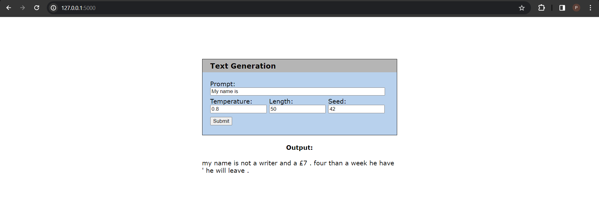

# NLP-A2-Language-Model
 
## Description:
Text generation application using a basic LSTM architecture.

## How to use:
1) From the terminal, use the 'cd' command change directory to 'NLP-A2-Language-Model/app/' folder.
2) Run the Python script 'app.py'.
3) Open your browser and go to '127.0.0.1:5000' to access the site locally.
4) Type in your prompt as well as select the appropriate values for parameteres (temperature, sequence length, seed) then click the submit button.
5) Your generated text will be shown below.

